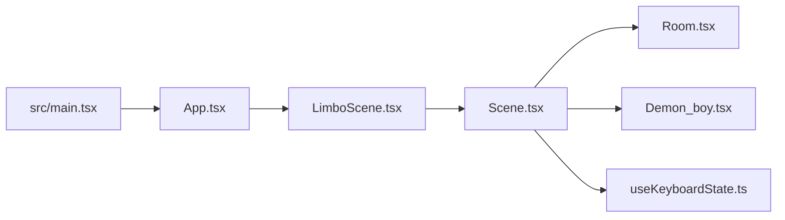
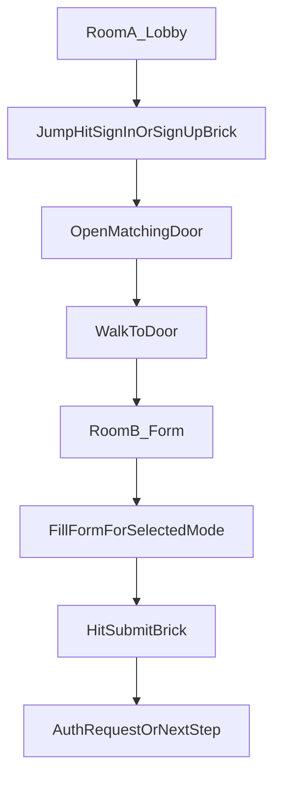

# SignupFormThreeJS — project information

This document describes the **repository layout**, **how the app runs today**, and a **target game plan** (product spec) for a multi-room sign-in / sign-up flow. Anything under “Target game plan” is **not fully implemented** in code yet; the “Current behavior” sections match the codebase as of this document.

---

## Purpose

An interactive **Limbo-inspired** side-view 3D scene built with **React** and **React Three Fiber**. The prototype explores moving a small character in a room, choosing **Sign In** or **Sign Up** by jumping into floating bricks, and opening a matching gate. The long-term direction is to connect this to real **authentication UI** (forms, submit) in a second room or overlay.

---

## Repository layout

```
SignupFormThreeJS/
├── index.html                 # Vite HTML shell, mounts #root
├── package.json               # Scripts and dependencies
├── vite.config.ts             # Vite + @vitejs/plugin-react
├── tsconfig*.json             # TypeScript project references
├── docs/
│   └── PROJECT_INFORMATION.md # This file
└── src/
    ├── main.tsx               # ReactDOM createRoot, StrictMode
    ├── App.tsx                # Renders LimboScene only
    ├── App.css                # Full-viewport scene + hint overlay
    ├── index.css              # Global base styles
    └── components/
        ├── index.ts           # export { LimboScene }
        └── limbo/             # All 3D “game” code
            ├── LimboScene.tsx
            ├── Scene.tsx
            ├── Room.tsx
            ├── Demon_boy.tsx
            ├── Atmosphere.tsx
            ├── SceneDebugControls.tsx
            ├── useKeyboardState.ts
            ├── constants.ts
            └── types.ts
```

### npm scripts (`package.json`)

| Script        | Command      | Purpose                          |
| ------------- | ------------ | -------------------------------- |
| `dev`         | `vite`       | Local dev server with HMR        |
| `build`       | `tsc -b && vite build` | Production bundle        |
| `typecheck`   | `tsc -b`     | Typecheck without emitting       |
| `lint`        | `eslint .`   | ESLint over the project          |
| `preview`     | `vite preview` | Serve production build locally |

### Main dependencies

- **react**, **react-dom** — UI
- **three** — 3D engine
- **@react-three/fiber** — React renderer for Three.js (`Canvas`, `useFrame`)
- **@react-three/drei** — Helpers (`Text`, `OrbitControls`, `Grid`, etc.)

---

## Runtime architecture

**Boot:** `index.html` loads `src/main.tsx`, which renders `<App />` inside `StrictMode`. `App` renders only `LimboScene`.

**3D shell:** `LimboScene` creates a full-viewport `<Canvas>` with a fixed camera preset and wraps the 3D tree in `Suspense` (required because `@react-three/drei` `Text` loads fonts asynchronously).

**Per frame:** `Scene` runs one `useFrame` loop that integrates **input → velocity → position**, runs **selection hit detection**, updates the character group transform, and optionally **follows the camera** along X.



---

## File roles (limbo module)

| File | Responsibility |
| ---- | ---------------- |
| `LimboScene.tsx` | Full-viewport `<Canvas>`, default camera (`position`, `fov`), `Suspense`, DOM hint text for controls (`App.css` `.hint`). |
| `Scene.tsx` | Main game loop: keyboard → movement, jump, gravity, world bounds, **head vs selection-box** hit test → `selected_side`, character `group` position, camera drift when not in debug orbit. |
| `Room.tsx` | Level geometry: floor, ceiling, side walls, two **selection slabs** (SIGN IN / SIGN UP), **gates** that slide up when open, hint arrows before choice, exit arrows after choice, `Text` labels. |
| `Demon_boy.tsx` | Procedural “yarn demon” character mesh; walk animation driven by `velocity_x_ref`; optional crouch via `is_crouching_ref` (unused in current scene). |
| `Atmosphere.tsx` | Limbo-style look: solid background color, fog, `hemisphereLight`, very dim `directionalLight` (mainly for debug helper visibility). |
| `SceneDebugControls.tsx` | When enabled: `OrbitControls`, infinite `Grid`, axis gizmo, `DirectionalLightHelper`. |
| `useKeyboardState.ts` | Window `keydown` / `keyup` → mutable ref of arrow key booleans (`preventDefault` for tracked keys). |
| `constants.ts` | World size, speeds, box positions, gate dimensions, **`DEBUG_R3F_ORBIT`**. |
| `types.ts` | `KeyState` interface for arrow keys. |

---

## Current behavior

### Controls

- **ArrowLeft / ArrowRight** — Horizontal movement (damped toward target speed).
- **ArrowUp** — Jump when grounded (`y <= 0.001`).

Implemented in `useKeyboardState.ts` and consumed in `Scene.tsx`.

### Physics (simplified)

- Horizontal velocity is **damped** toward ±`move_speed` based on held arrows.
- Vertical: on jump, `velocity_y` is set to `jump_force`; each frame gravity subtracts `gravity * delta`.
- Position is integrated each frame; **Y** is clamped to the floor at `0`.
- **X** is clamped to `world_bounds` **until** a side is selected; then the open side’s bound is extended so the character can walk far off-screen.

Constants live in `constants.ts` (e.g. `move_speed`, `jump_force`, `gravity`, `world_bounds`).

**Jump height vs bricks:** Selection box center height is `BOX_Y` with half-height `BOX_HALF_H`. Jump parameters were chosen so the character’s approximate **head** height during a jump can intersect the box band used in hit detection (see `Scene.tsx`).

### Selection and gates (implemented)

1. Two floating **selection boxes** in the center: **SIGN IN** (left box, `BOX_LEFT_X`) and **SIGN UP** (right box, `BOX_RIGHT_X`).
2. While **moving upward** (`velocity_y > 0.5`), if the character’s approximate **head Y** lies in the box vertical range and **X** is near that box, `selected_side` becomes `'left'` or `'right'`.
3. This triggers **only once** (`has_selected_ref` guard).
4. **Left choice** opens the **left** gate; **right choice** opens the **right** gate (`Room.tsx` `Gate` animates upward with damping).
5. **Hint arrows** hide after a choice; a pulsing **exit arrow** appears near the open gate.

### What is not implemented yet

- No **room swap** when reaching the door (walking off-screen does not load another scene).
- No **HTML/React form** for credentials; labels are 3D `Text` only.
- No **submit brick** or submit action wired to auth.

---

## Debug mode (`DEBUG_R3F_ORBIT`)

In `src/components/limbo/constants.ts`, **`DEBUG_R3F_ORBIT`** is currently **`true`**.

When `true`:

- `SceneDebugControls` mounts **OrbitControls** as the default camera control (mouse orbit, zoom, pan).
- A **grid**, **gizmo**, and **directional light helper** are shown for scene tuning.

When `true`, the **game-style camera follow** in `Scene.tsx` (`if (!DEBUG_R3F_ORBIT) { ... }`) does **not** run, so the experience is editor-like rather than a locked side-scroller.

For a **player-only side-view** experience, set **`DEBUG_R3F_ORBIT`** to **`false`** in `constants.ts`.

---

## How to run

1. Install dependencies: `npm install`
2. Start dev server: `npm run dev` — open the URL Vite prints (usually `http://localhost:5173`).
3. Optional: `npm run typecheck` — verify TypeScript.
4. Optional: `npm run build` then `npm run preview` — test production build locally.

---

## Target game plan (product spec)

This section describes the **intended full experience**. Implementation may be phased (3D only first, then DOM form overlay, etc.).

### Room A — Lobby

- A **room** contains a **boy** (player character) with **jump** and **walk**.
- Two **bricks** (or slabs) represent **Sign In** and **Sign Up**.
- The boy **jumps** and **hits** the brick that matches his choice (same interaction pattern as today’s head/box hit).
- Hitting a brick **opens the door on that side** of the room (left door for sign-in, right for sign-up, consistent with current mapping).
- The boy **moves toward that door** and **enters** it; crossing a threshold should **change the room** (new scene, level segment, or camera transition) so the player clearly feels they left the lobby.

### Room B — Form room

- After the transition, the player sees a **form** whose **fields depend on the selected option**:
  - **Sign In** — e.g. email/username + password (and any “forgot password” entry point you add later).
  - **Sign Up** — e.g. email, password, confirm password, or whatever your product requires.
- **Filling the form** can be implemented as:
  - Standard **accessible HTML inputs** (keyboard/tab), possibly overlaid on or beside the 3D view; and/or
  - **In-world** prompts (harder UX); a **hybrid** (3D character + HTML form) is often the most practical.

### Submit

- A dedicated **submit brick** (or reuse the same “jump to hit” mechanic on a labeled slab) **submits** the form when struck, after validation (client-side first; server integration as a separate layer).
- Clear **feedback** (success/error) should follow the submit action.

### Flow summary



---

## Summary

| Topic | Status |
| ----- | ------ |
| Side-view room, character, jump, walk | Implemented |
| Sign In / Sign Up bricks + one-shot choice | Implemented |
| Matching gate opens, exit hint | Implemented |
| Extended walk off open side | Implemented |
| Orbit debug camera | On by default (`DEBUG_R3F_ORBIT`) |
| Room change at door | Planned |
| Form UI + validation | Planned |
| Submit brick / submit action | Planned |

For questions about **implementation details**, start from `Scene.tsx` (logic) and `Room.tsx` (level + visuals).
